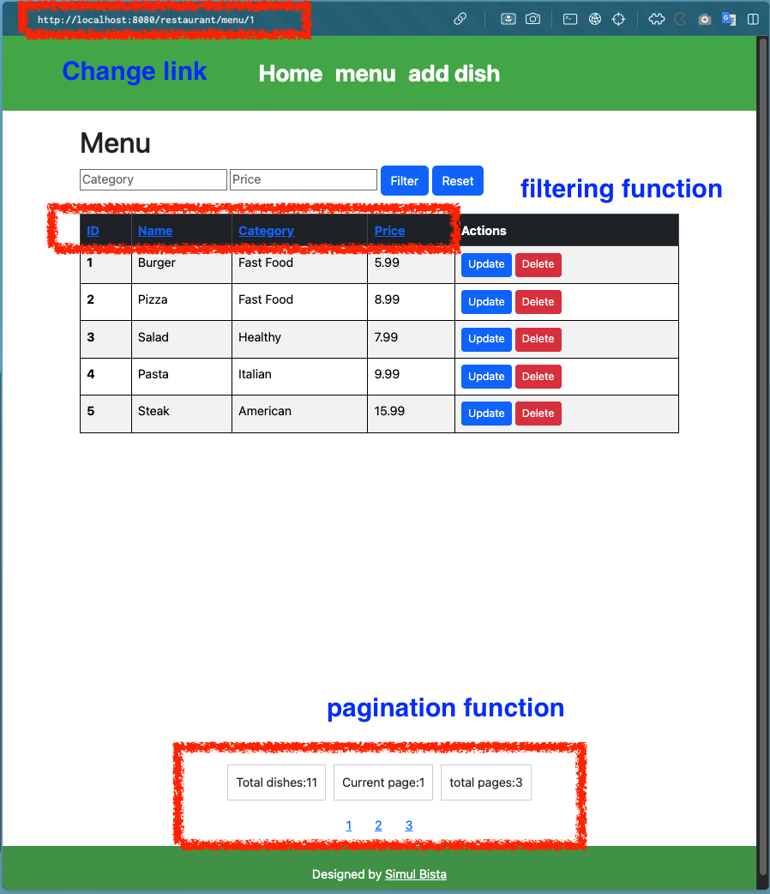

# Implementation Summary

1. Menu Display Functionality

- Displays the ID, name, category, and price of dishes in a table format.

2. Filtering Functionality

- Implements a feature to filter dishes based on category and price input.
- Displays only the dishes that match the specified conditions when the filter button is clicked.
- Resets to show all dishes when the reset button is pressed.

3. Sorting Functionality

- Adds functionality to sort the ID and price columns in ascending or descending order.
- Users can click on any column to sort it as desired.

4. Pagination Functionality

- Implements pagination for cases when there are many menu items.
- The initial URL is .../restaurant/menu/1, displaying the first page of pagination.
- The Menu page is set to display 5 items per page.

